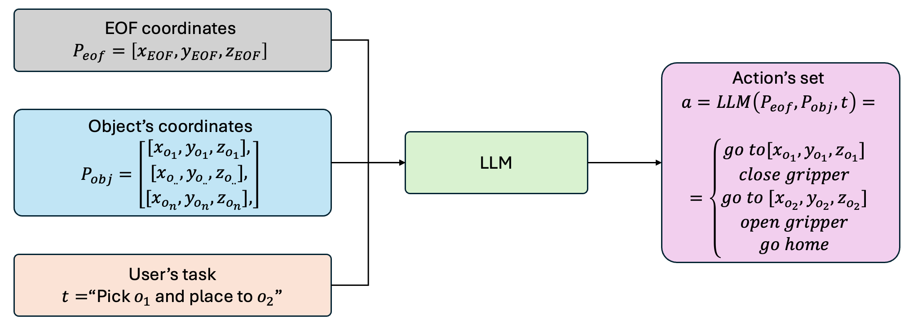

# GEN_AI Project: Applied case studies of Machine Learning C-D5041E
## The task

The goal of this project is to fine-tune a generative model capable of creating a sequence of actions for a robot to complete a given task. \
Specifically, the model should receive the following inputs:
- A list of objects on the table along with their spatial coordinates (x, y, z)
- The task to be performed
Based on these inputs, the model should be able to generate the correct sequence of actions to ensure the successful completion of the specified task.

## The schema


### EOF coordinates
This element represents the robot's position relative to its own reference system.

### Objects coordinates
This element represents the position of all objects in the scene, indicating their location relative to the robot's base.\
You can select a minimum of 4 objects and a maximum of 8, at your discretion.

### User's task
This element represents the task that the user wants the robot to perform. \
The model must be able to execute at least two types of tasks of your choice. \
If you're lacking inspiration, a list of possible tasks for the robot to perform is provided below.
- pick obj_A and place to obj_B;
- lift obj_A;
- move obj_A forward;
- move obj_A backward;
- move obj_A on the left;
- move obj_A on the right;

## Hint for the training: axolotl
It is possible to fine-tune a generative model using various libraries; one of them is [Axolotl](https://github.com/axolotl-ai-cloud/axolotl).\
More details about the fine-tuning [here](https://github.com/axolotl-ai-cloud/axolotl?tab=readme-ov-file#usage).\
**advice:** if you choose to use this library use the docker version of it.


## Usefull imports
```bash
pip  install trl peft torch datasets transformers jupyterlab accelerate tiktoken matplotlib bitsandbytes evaluate scikit-learn
```
**optional**: docker
